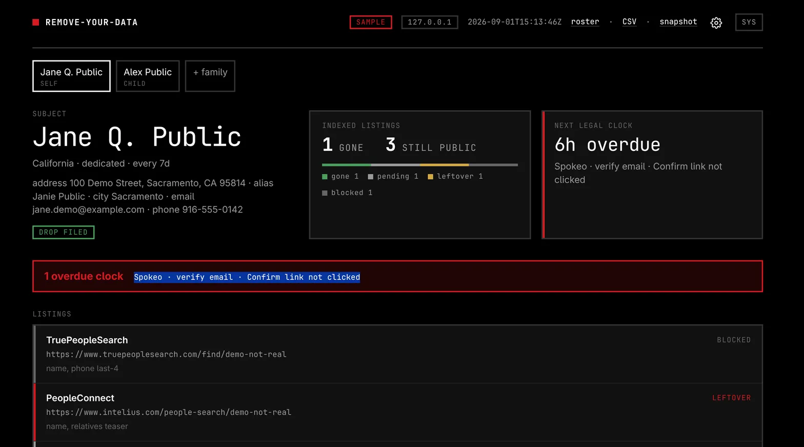

# remove-your-data



Agent skill: remove a person's listings from people-search sites and data brokers **without paying deletion services**. First-party opt-outs, CA DROP when they live in California, a SQLite legal log, a localhost report.

This is not legal advice.

## If you are an agent

This repo **is** the skill. You do not need a human to explain it.

1. Read [`AGENTS.md`](AGENTS.md) (boot).
2. Read [`SKILL.md`](SKILL.md) (playbook).
3. Start §1. Roster (aliases, addresses, phones, family) is SQLite + `/roster`. Then run the loop.

Workspace (`takedown.db`, evidence) goes **outside** this clone.

```bash
python3 scripts/ryd.py init --workspace "$HOME/privacy-takedown"
python3 scripts/ryd.py serve --workspace "$HOME/privacy-takedown"
# report    http://127.0.0.1:8765/
# roster    http://127.0.0.1:8765/roster
# settings  http://127.0.0.1:8765/settings
```

## If you are a human

Paste this URL into your coding agent (Claude, Codex, Pi, OMP, Hermes, OpenClaw, Cursor, Grok, or anything that will clone a repo and read `AGENTS.md` / `SKILL.md`):

```text
https://github.com/k7cfo/remove-your-data
```

Say: *remove my data from people-search sites.* The agent should ask where you live first. California → [DROP](https://privacy.ca.gov/drop/) first.

## Do not fork

Do not publish a fork. Open a **pull request here**.

We want as many PRs as possible: dead opt-out URLs, new official forms, DROP/GDPR clock corrections, captcha and mailbox gotchas, search queries that actually find listings, notes for a specific agent host. That is how this stays a good open-source skill. GitHub's Fork button is only for sending that PR.

See [`CONTRIBUTING.md`](CONTRIBUTING.md).

## Why

Data brokers publish you. Paid “we'll delete you” apps mostly file the same free forms, then charge rent because brokers re-scrape. Some of those brands sit next to the people-search business. This skill is the mop you run yourself.

## License

[AGPL-3.0-or-later](LICENSE). Free to use. If you ship a modified copy, or run a modified version as a network service, keep it AGPL and share the source. Contributions are inbound=outbound. Details in `LICENSE`.
